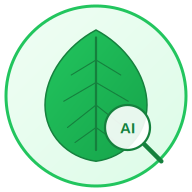

# 🌿 Plant Disease Detector

Aplicación web PWA para la detección de enfermedades en hojas de plantas utilizando inteligencia artificial y visión por computadora.



## 📋 Descripción

Esta aplicación permite a agricultores, jardineros y entusiastas de las plantas detectar enfermedades en hojas de manzano de forma rápida y sencilla usando la cámara de su dispositivo móvil o subiendo imágenes.

### Enfermedades Detectadas

- ✅ **Saludable** - Hoja sin enfermedades
- 🟤 **Roya (Rust)** - Manchas anaranjadas/marrones causadas por hongos
- ⚫ **Sarna (Scab)** - Lesiones oscuras y costrosas
- 🔴 **Múltiples Enfermedades** - Presencia de más de una enfermedad

## 🚀 Características

- 📸 **Captura en tiempo real** con la cámara del dispositivo
- 📤 **Subida de imágenes** con drag & drop
- 🤖 **Análisis con IA** usando TensorFlow.js (100% cliente)
- 🔍 **Visualización de áreas afectadas** con overlay
- 📊 **Gráficas de confianza** para cada diagnóstico
- 💊 **Recomendaciones de tratamiento** personalizadas
- 📱 **PWA instalable** - funciona sin conexión
- 📜 **Historial de análisis** guardado localmente

## 🛠️ Tecnologías

- **Frontend**: Next.js 14, React 18, TypeScript
- **Estilos**: Tailwind CSS, shadcn/ui
- **ML**: TensorFlow.js (inferencia en cliente)
- **Visión**: OpenCV.js (segmentación de áreas)
- **Storage**: IndexedDB, LocalStorage
- **PWA**: Service Worker, Web App Manifest

## 📁 Estructura del Proyecto

```
plant-disease-detector/
├── app/                    # App Router de Next.js
│   ├── analyze/           # Página de análisis
│   ├── guide/             # Guía de enfermedades
│   ├── history/           # Historial de análisis
│   ├── api/               # API Routes
│   ├── layout.tsx         # Layout principal
│   ├── page.tsx           # Página inicio
│   └── globals.css        # Estilos globales
├── components/            # Componentes React
│   ├── analysis/          # Resultados y visualización
│   ├── camera/            # Captura de cámara
│   ├── upload/            # Subida de archivos
│   ├── common/            # Header, Footer, etc.
│   ├── ui/                # Componentes base (shadcn)
│   └── icons/             # Íconos SVG personalizados
├── hooks/                 # Custom hooks
│   ├── useAnalysis.ts     # Lógica de análisis
│   ├── useCamera.ts       # Control de cámara
│   └── useModel.ts        # Carga del modelo
├── lib/                   # Utilidades
│   ├── ml/                # TensorFlow.js
│   ├── opencv/            # OpenCV.js
│   ├── camera/            # WebRTC helpers
│   ├── storage/           # IndexedDB/LocalStorage
│   └── constants/         # Configuración
├── public/
│   ├── models/            # Modelo TensorFlow.js
│   ├── icons/             # Íconos PWA
│   ├── manifest.json      # Web App Manifest
│   └── sw.js              # Service Worker
├── types/                 # TypeScript definitions
└── styles/                # Estilos adicionales
```

## 🏃‍♂️ Instalación y Desarrollo

### Prerequisitos

- Node.js 18+
- npm o yarn

### Pasos

1. **Clonar el repositorio**
```bash
git clone <repo-url>
cd plant-disease-detector
```

2. **Instalar dependencias**
```bash
npm install
```

3. **Agregar el modelo ML** (ver sección siguiente)

4. **Iniciar en desarrollo**
```bash
npm run dev
```

5. **Abrir en navegador**
```
http://localhost:3000
```

## 🧠 Modelo de Machine Learning

El modelo debe estar en formato TensorFlow.js y colocarse en `public/models/`:

```
public/models/
├── model.json
└── group1-shard1of1.bin (o múltiples shards)
```

### Convertir desde Keras

```python
import tensorflowjs as tfjs

model = tf.keras.models.load_model('plant_disease_model.h5')
tfjs.converters.save_keras_model(model, 'public/models/')
```

### Especificaciones del modelo

- **Input**: Imagen RGB 224x224
- **Output**: 4 clases (healthy, multiple_diseases, rust, scab)
- **Formato**: TensorFlow.js LayersModel

## 🔧 Configuración

Edita `lib/constants/config.ts` para personalizar:

```typescript
export const MODEL_CONFIG = {
  modelPath: '/models/model.json',
  inputSize: 224,
  classes: ['healthy', 'multiple_diseases', 'rust', 'scab'],
  confidenceThreshold: 0.5
};
```

## 📱 PWA - Instalación

La aplicación es una Progressive Web App instalable:

1. Abre la app en Chrome/Safari
2. Click en "Añadir a pantalla de inicio"
3. La app funcionará sin conexión

## 🚀 Despliegue

### Vercel (Recomendado)

```bash
npm install -g vercel
vercel
```

### Build de producción

```bash
npm run build
npm run start
```

## 🧪 Testing

```bash
# Lint
npm run lint

# Type check
npx tsc --noEmit

# Build test
npm run build
```

## 📄 Dataset

Este proyecto utiliza el dataset de [Plant Pathology 2020 - FGVC7](https://www.kaggle.com/c/plant-pathology-2020-fgvc7) de Kaggle para entrenar el modelo.

## 🤝 Contribuir

1. Fork el repositorio
2. Crea una rama (`git checkout -b feature/nueva-feature`)
3. Commit cambios (`git commit -m 'Add: nueva feature'`)
4. Push (`git push origin feature/nueva-feature`)
5. Abre un Pull Request

## 📝 Licencia

MIT License - ver [LICENSE](LICENSE) para más detalles.

## 👥 Autores

- Daniel (Plant Disease Detector Team)

## 🙏 Agradecimientos

- Kaggle y los organizadores de Plant Pathology 2020
- TensorFlow.js team
- Next.js team
- OpenCV.js contributors
